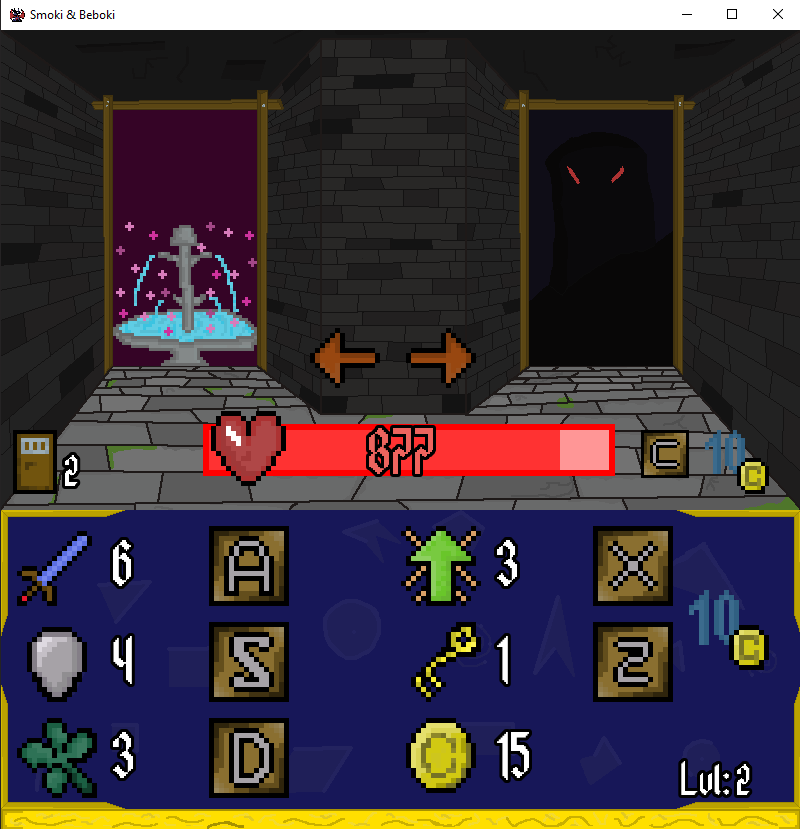

# Smoki-Beboki
Smoki & Beboki is one of my first projects made for my studies  
The project was written in C++ using a SFML library  
It's very simple game based on the exploration mechanics of "Shakes and Fidget" ~Legendary Dungeon  
All you have to do is explore the dungeon, kill the enemies, improve yourself and break you records

##Screenshot

